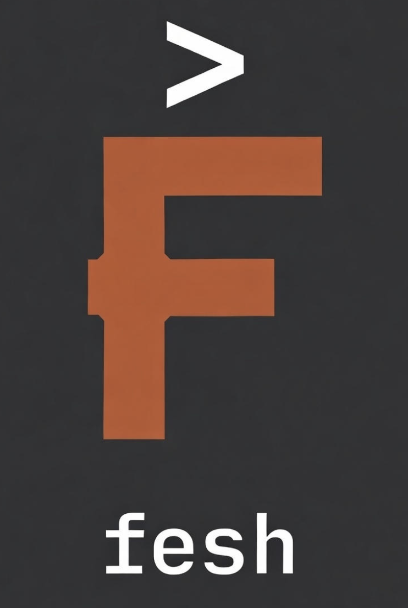

<div style="display: table; width: 100%;">
  <div style="display: table-cell; vertical-align: top;">

# fesh ⚙️
A simple shell implemented in Rust. *fesh* stands for **Fe** (ferrum) **sh**ell.
This project was created as part of a university course to deepen my understanding of both shells and the Rust programming language 🤓

  </div>
  <div style="display: table-cell; text-align: right; width: 200px;">
  


  </div>
</div>

## Features

### Pipes
Chain commands together using pipes:
```shell
find . | wc -l
cat file.txt | grep "pattern" | sort
```

### Redirects
Redirect output to files:
```shell
echo "hello world" > file.txt   # overwrite
echo "another line" >> file.txt # append
```

### History
- Store recent commands in a history file
- Completion hints as you type
- Search with `Ctrl+R` (i-search)

### Builtin Commands
| Command | Description |
|---------|-------------|
| `cd <dir>` | Change directory |
| `exit` | Exit the shell |
| `aliases` | List all defined aliases |
| `set <VAR> <VALUE>` | Set an environment variable |
| `+debug` | Toggle debug mode |

## Configuration

`fesh` uses a [TOML](https://toml.io/en/) config file for customization. See [config.toml](./config.toml) for full reference.

### Config Location
The config file is located at:
- `$XDG_CONFIG_HOME/fesh/config.toml`
- Falls back to `~/.config/fesh/config.toml`

If no config file is found, fesh uses default settings and shows an info message at startup.

Override with the `FESH_CONFIG_FILE` environment variable:
```shell
FESH_CONFIG_FILE=/path/to/config.toml fesh
```

### Config Options

**Prompt**
- `text` - prompt text (e.g. `"$ "`)
- `color` - prompt color
- `show_cwd` - show current working directory
- `show_username` - show username
- `show_branch` - show current git branch

**Aliases**
```toml
[aliases]
ll = "ls -lah"
gs = "git status"
```

**Readline**
- `edit_mode` - `"emacs"` or `"vi"`

**History**
- `history_path` - absolute path to history file
- Defaults to `$XDG_DATA_HOME/fesh/history` (or `~/.local/share/fesh/history`)

**Environment Variables**
```toml
[env]
EDITOR = "vim"
MY_VAR = "my_value"
```

## Development

### Build
```shell
cargo build
```

### Run tests
```shell
cargo test

# or use nextest for better output
cargo install cargo-nextest --locked
cargo nextest run
```
